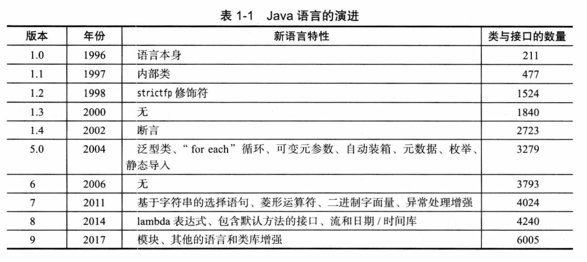

# 第 1 章 Java 程序设计概述

## 1.1 Java 程序设计平台

- 新增特性不简洁：由于兼容性需求，新增的一些特性就没有原有特性那么简洁精练。
- Java 是一个平台：Java 并不只是一种语言，Java 是一个完整的平台，有一个庞大的库，其中包含了很多可重用的代码，以及一个提供诸如安全性、跨操作系统的可移植性以及自动垃圾收集等服务的执行环境。

## 1.2 Java“白皮书”的关键术语

- 白皮书：<https://www.oracle.com/technetwork/java/langenv-140151.html>。
- 11 个关键术语：<http://horstmann.com/corejava/java-an-overview/7Gosling.pdf>。

| 关键术语        | 关键术语    |
| --------------- | ----------- |
| 1）简单性       | 7）可移植性 |
| 2）面向对象     | 8）解释性   |
| 3）分布式       | 9）高性能   |
| 4）健壮性       | 10）多线程  |
| 5）安全性       | 11）动态性  |
| 6）体系结构中立 |             |

### 1.2.1 简单性

- 语法简单：Java 语法是 C++ 语法的“纯净”版本，没有头文件、指针运算、指针语法、结构、联合、操作符重载、虚基类等。
- 体积小：基本解释器以及类支持大约 40 KB，再加上标准类库和线程的支持增加约 175 KB（当时）。
- JavaME：有一个较小类库的 Java 微型版（Java Micro Edition），适用于嵌入式设备。

### 1.2.2 面向对象

- 接口：Java 与 C++ 的主要不同点在于用接口取代了 C++ 的多重继承。
- 反射：Java 提供了更丰富的运行时自省功能。

### 1.2.3 分布式

- 实现便捷：访问网络上的资源便捷程度好像访问本地一样。

### 1.2.4 健壮性

- 编译时检查：Java 编译器能够检测其他语言在运行时才能够检测出来的问题。
- 没有指针破坏数据：Java 采用的指针模型可以消除重写内存和损坏数据的可能性，开发者不会遭受调试 C/C++ 指针 bug 的痛。

### 1.2.5 安全性

略。

### 1.2.6 体系结构中立

- 字节码：Java 编译器生成与特定的计算机体系结构无关的字节码，由虚拟机解释执行。

### 1.2.7 可移植性

- 类型大小确定：基本数据类型的大小以及运算行为都有明确的说明。
- 大小端固定：二进制数据以固定的格式进行存储和运输，消除了字节顺序的困扰。
- Unicode：字符串采用标准的 Unicode 格式存储。
- API 统一：系统组成部分的类库定义了可移植的接口，针对不同操作系统给出不同实现。

### 1.2.8 解释型

- JShell：前 20 年没有把重点放在这种体验上，直到 Java 9 提供了 JShell 工具支持快捷而且具有探索性的编程。

### 1.2.9 高性能

- JIT：即时编译器可以监控哪些代码频繁执行，并优化这些代码以提高速度。某些情况下超越了传统编译器。

### 1.2.10 多线程

- 第一个支持并发程序设计的主流语言。

### 1.2.11 动态性

- J++/C#：Java 推出不久后，微软发布了 J++，与 Java 有几乎相同的编程语言和虚拟机，后被 C# 取代。

## 1.3 Java applet 与 Internet

- 示例：<http://jmol.sourceforge.net/demo/aminoacids.html>（已经不是使用 applet 了）。

> **浏览器怎样开启 applet 支持：** [How do I enable Java in my web browser?](https://www.java.com/en/download/help/enable_browser.html)
>

## 1.4 Java 发展简史

- 1991 年 Sun 公司 Green 项目，由 Patrick Naughton 和 James Gosling 带领设计的一种小型计算机语言。以 C++ 为基础，Gosling 称这门语言为 Oak（大概他喜欢办公室外的一颗橡树），后发现已经有一门语言叫 Oak，改名为 Java。
- 1994 年 First Person 公司（之前的 Green 项目）解散。
- 1995 年 Patrick Naughton 和 Jonathan Payne 使用 Java 开发了 HotJava 浏览器。
- 1996 年 Sun 发布了 Java 1.0。
- 1998 年发布了 1.2，并更名为“Java 2 标准版软件开发包 1.2 版”，除了 Java SE，还有 Java ME 和 Java EE。
- 2000 年和 2002 年 发布了 1.3 和 1.4，对 Java 2 版本做了增量式改进。
- 2004 年发布了重大改进版本 5.0（原定 1.5）。
- 2006 年发布了 6（没有后缀 .0）。
- 2009 年 Sun 被 Oracle 收购，发布了 Java 7。
- 2014 年发布了 Java 8。
- 2017 年发布了 Java 9，主要特性要一直追溯到 2008 年。
- 2018 年开始每 6 个月就发布一个 Java 版本。

**Java 语言的演进：**



> **Java 版本发布：**
>
> - 发布计划：[List View](https://www.java.com/releases)、[View by Month](https://www.java.com/releases/matrix)、[All Releases](https://www.java.com/releases/fullmatrix/)。
> - 路线图：[Oracle Java SE Support Roadmap](https://www.oracle.com/java/technologies/java-se-support-roadmap.html)。
> - 长期支持版本（LTS）：7、8、11、17、21。
>
> **Java 版本计算：** 2018 年 3 月发布的 10，9 月发布的 11，每年发布两个版本，那么 20xx 年 3 月发布的版本是：
>
> ```text
>(xx - 18) * 2 + 10
> ```

## 1.5 关于 Java 的常见误解

略。
