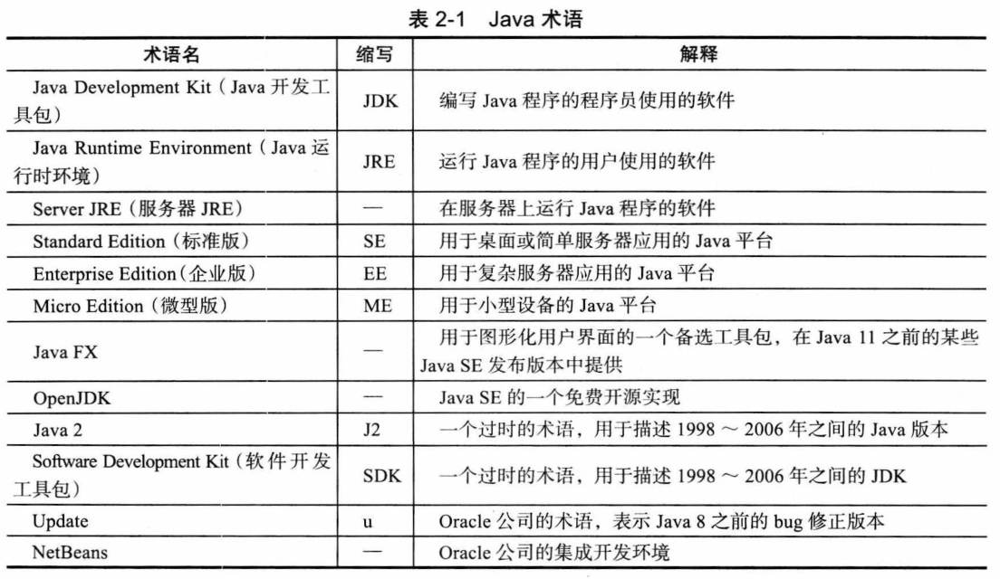

# 第 2 章 Java 程序设计环境

## 2.1 安装 Java 开发工具包

### 2.1.1 下载 JDK

- 下载地址：<https://www.oracle.com/technetwork/java/javase/downloads>。

**Java 相关术语：**

- Java 2：提法始于 1998，销售感觉 JDK 1.2 没有反映出重大改进，版本号仍然沿用 1.2、1.3、1.4 和 5.0，因此有了 Java 2 Standard Edition Software Development Kit 5.0（Java 2 标准版软件开发包 5.0 版，J2SE SDK 5.0）。
- Java SE：2006 年简化为 Java SE 6，内部版本仍然是 1.6.0、1.7.0 和 1.8.0。2017 年 Java SE 9 版本号变为 9（版本号规范要求在主版本和第一次安全更新之间删除末尾的 0），以及后来的 9.0.1。

### 2.1.2 设置 JDK

略。

### 2.1.3 安装库源文件和文档

略。

## 2.2 使用命令行工具

- shebang：在 JDK 11 中，单个源文件不再需要 javac 命令。这个特性是为了支持以 “shebang”（#!）行（`#!/path/to/java`）开头的 shell 脚本。

> **什么是 shebang：** 长期以来，shebang 都没有正式的中文名称。Linux 中国翻译组的 GOLinux 将其翻译为“释伴”，即“解释伴随行”的简称，同时又是 shebang 的音译。

## 2.3 使用集成开发环境

略。

## 2.4 JShell

略。
